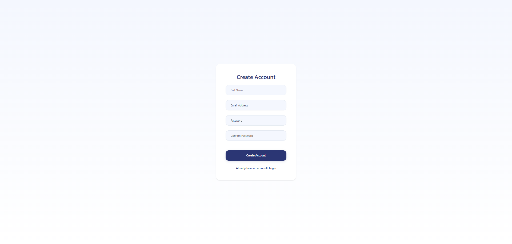
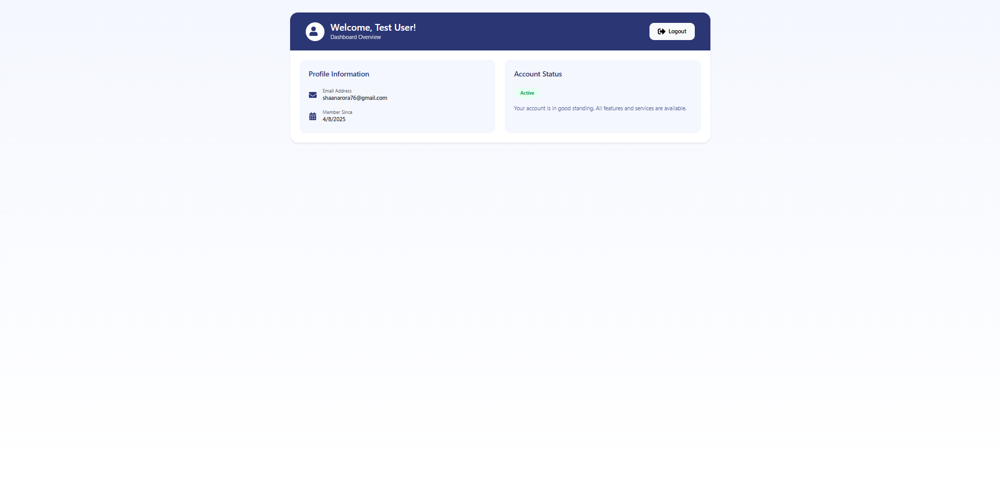

# Full-Stack Intern Assignment

This is a full-stack application with a React frontend and Node.js backend, implementing user authentication and protected routes.

## Project Structure

- **Frontend**: React application with TypeScript, Zod for validation, React Hook Form for form management, and React Query for data fetching
- **Backend**: Node.js server with Express, TypeScript, and Prisma for database management

## Getting Started

### Prerequisites

- Node.js (v14 or later)
- npm or yarn

### Step-by-Step Setup Instructions

#### Backend Setup

1. Clone the repository or create the project structure:
```bash
mkdir -p fullstack-project/backend fullstack-project/frontend
cd fullstack-project/backend
```

2. Initialize the backend project:
```bash
npm init -y
```

3. Install required dependencies:
```bash
npm install express @prisma/client cors dotenv bcrypt jsonwebtoken
npm install -D typescript @types/node @types/express @types/cors @types/bcrypt @types/jsonwebtoken ts-node prisma nodemon
```

4. Initialize TypeScript configuration:
```bash
npx tsc --init
```

5. Initialize Prisma:
```bash
npx prisma init
```

6. Configure Prisma schema in `prisma/schema.prisma`:
```prisma
generator client {
  provider = "prisma-client-js"
}

datasource db {
  provider = "sqlite"
  url      = env("DATABASE_URL")
}

model User {
  id        String   @id @default(uuid())
  email     String   @unique
  password  String
  createdAt DateTime @default(now())
  updatedAt DateTime @updatedAt
}
```

7. Update the `.env` file with the database connection:
```
DATABASE_URL="file:./dev.db"
JWT_SECRET="your-secret-key"
```

8. Generate Prisma client and create migrations:
```bash
npx prisma generate
npx prisma migrate dev --name init
```

9. Create the project structure:
```bash
mkdir src
cd src
mkdir controllers routes middlewares utils
```

10. Update the package.json scripts:
```json
"scripts": {
  "start": "node dist/index.js",
  "dev": "nodemon --exec ts-node src/index.ts",
  "build": "tsc",
  "prisma:generate": "prisma generate",
  "prisma:migrate": "prisma migrate dev",
  "prisma:studio": "prisma studio"
}
```

11. Create the backend files as detailed in this repository.

#### Frontend Setup

1. Create a new React app with TypeScript:
```bash
cd ../frontend
npx create-react-app . --template typescript
```

2. Install required dependencies:
```bash
npm install zod react-hook-form @tanstack/react-query axios react-router-dom @hookform/resolvers
npm install bootstrap
npm install react-icons@4.12.0
npm install framer-motion
```

3. Update the `src/index.css` file:
```css
body {
  margin: 0;
  font-family: -apple-system, BlinkMacSystemFont, 'Segoe UI', 'Roboto', 'Oxygen',
    'Ubuntu', 'Cantarell', 'Fira Sans', 'Droid Sans', 'Helvetica Neue',
    sans-serif;
  -webkit-font-smoothing: antialiased;
  -moz-osx-font-smoothing: grayscale;
}

code {
  font-family: source-code-pro, Menlo, Monaco, Consolas, 'Courier New',
    monospace;
}
```

4. Import Bootstrap in your App.tsx file:
```tsx
// In App.tsx
import 'bootstrap/dist/css/bootstrap.min.css';
```

5. Create the project structure:
```bash
cd src
mkdir components hooks api types utils pages context
```

6. Create the frontend files as detailed in this repository:
   - Create the API service in `src/api/authApi.ts`
   - Create TypeScript types in `src/types/index.ts`
   - Create form validation schemas in `src/utils/schemas.ts`
   - Create Zod form hook in `src/hooks/useZodForm.ts`
   - Create Auth context in `src/context/AuthContext.tsx`
   - Create reusable components in `src/components/`
   - Create pages in `src/pages/`
   - Update the App.tsx file with routes

7. Update components to use Bootstrap classes instead of Tailwind classes:
   - For example, change `className="flex items-center justify-center"` to `className="d-flex align-items-center justify-content-center"`
   - Change `className="w-full"` to `className="w-100"`
   - Change `className="mt-4"` to `className="mt-4"`

### Fixing React Icons TypeScript Errors

If you encounter TypeScript errors with React Icons like:
```
TS2786: 'FaUser' cannot be used as a JSX component.
Its return type 'ReactNode' is not a valid JSX element.
```

Use one of these solutions:

1. Use React.createElement to render icons:
```tsx
// Instead of this:
<FaUser className="me-2" />

// Use this:
{React.createElement(FaUser, { className: "me-2" })}
```

2. Or downgrade to a specific version of react-icons:
```bash
npm install react-icons@4.12.0 --save
```

## Login Page Variants

The application includes two different login page designs:

### 1. Simple Login (Default)

The default login page is a minimal design matching the provided Figma design. It features:
- Clean, minimalist UI with centered inputs
- Basic form with UID/Email and Password fields
- Simple blue login button
- Links to the original login page and registration

This design was based on [the Figma design](https://www.figma.com/design/lCZE6xYelO0YJ4rN3XOzhL/Assignment-Login-Page?node-id=1-276&t=khAiO88DT1y0SCjZ-0).

### 2. Original Login

The original login page offers a more feature-rich experience with:
- Icon-based inputs
- Password visibility toggle
- Form validation messages
- Loading states
- Animation effects

You can switch between the two designs using the link at the bottom of each login page.

## Screenshots

### Login Page

*The minimalist login page based on the Figma design*

### Registration Page

*The registration page for creating new accounts*

### Dashboard Page

*The protected dashboard page shown after successful login*

## Running the Project

1. Start the backend:
```bash
cd backend
npm run dev
```

2. Start the frontend:
```bash
cd frontend
npm start
```

3. Access the application at `http://localhost:3000`

## Project Features

- User authentication (register, login, logout)
- Protected routes
- Form validation with Zod
- TypeScript throughout for type safety
- Prisma for database access
- Error handling
- Responsive UI with Bootstrap
- Animated UI components with Framer Motion
- Icon integration with React Icons
- Multiple UI variants (simple and feature-rich login pages)

## File Structure

```
|- backend/
|  |- prisma/
|  |  |- schema.prisma
|  |
|  |- src/
|  |  |- controllers/
|  |  |  |- authController.ts
|  |  |- middlewares/
|  |  |  |- authMiddleware.ts
|  |  |- routes/
|  |  |  |- auth.ts
|  |  |- utils/
|  |  |  |- AppError.ts
|  |  |- index.ts
|  |
|  |- .env
|  |- package.json
|  |- tsconfig.json
|
|- frontend/
|  |- public/
|  |- src/
|  |  |- api/
|  |  |  |- authApi.ts
|  |  |- components/
|  |  |  |- Button.tsx
|  |  |  |- FormInput.tsx
|  |  |  |- ProtectedRoute.tsx
|  |  |- context/
|  |  |  |- AuthContext.tsx
|  |  |- hooks/
|  |  |  |- useZodForm.ts
|  |  |- pages/
|  |  |  |- Dashboard.tsx
|  |  |  |- Login.tsx
|  |  |  |- SimpleLogin.tsx
|  |  |  |- Register.tsx
|  |  |- types/
|  |  |  |- index.ts
|  |  |- utils/
|  |  |  |- schemas.ts
|  |  |- App.tsx
|  |  |- index.tsx
|  |
|  |- package.json
```

## Technologies Used

### Frontend
- React with TypeScript
- React Router for routing
- React Hook Form for form management
- Zod for validation
- React Query for data fetching
- Bootstrap for styling
- React Icons for UI icons
- Framer Motion for animations

### Backend
- Node.js with Express
- TypeScript
- Prisma ORM
- JWT for authentication
- bcrypt for password hashing